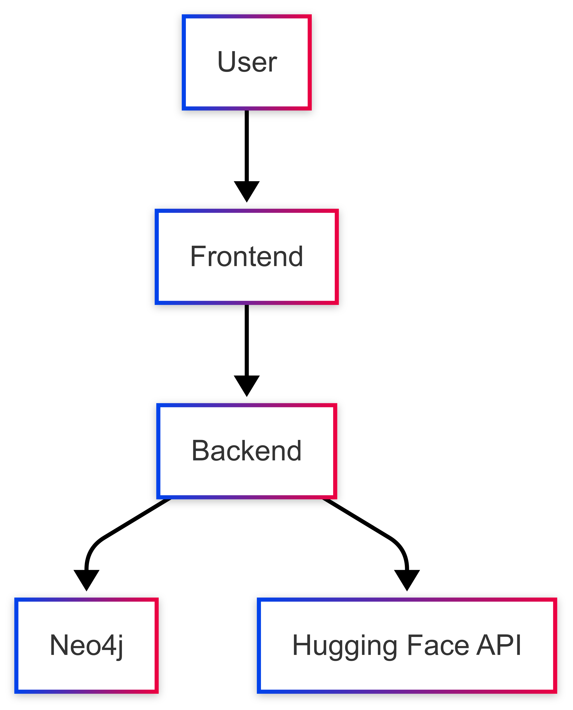
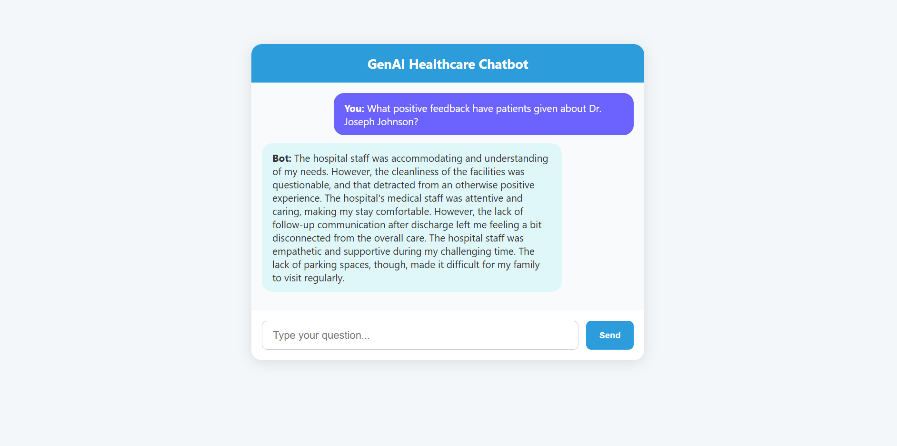

# 🚀 GenAI Healthcare Backend

*Your intelligent healthcare assistant powered by FastAPI, Neo4j Desktop, and Hugging Face models.*

---

## 🔍 Project Overview

**This backend powers the GenAI Healthcare Chatbot, a smart assistant that leverages a local graph database and state-of-the-art NLP models to answer healthcare-related queries with context-aware precision.**

**Built with:** FastAPI, Neo4j Desktop (local), Hugging Face Transformers  
**Purpose:** Deliver insightful, patient-centric responses by querying graph data and generating natural language answers.


---
## 🛠 Tech Stack

**Frontend:**  
- React (JavaScript)
- Axios (API requests)
- HTML5 & CSS3 (inline styles, responsive design)

**Backend:**  
- FastAPI (Python)
- Uvicorn (ASGI server)
- Python-dotenv (env variable management)

**Database:**  
- Neo4j Desktop (Graph Database)

**AI/NLP:**  
- Hugging Face Transformers (flan-t5-large)

**Other Tools:**  
- Git & GitHub (version control)
- Visual Studio Code (recommended editor)
- REST Client (Postman or browser for API testing)

---
## 📜 Certification

This project was certified by **Intel®**.

[View Certificate (PDF)](INTEL_CERTIFICATE.pdf)

---
## ⚙️ Features

- FastAPI REST API with clean, scalable endpoints  
- Neo4j Desktop integration for complex healthcare graph queries  
- Hugging Face transformer model (e.g., `flan-t5-large`) for natural language understanding  
- `/chat` endpoint for interactive Q&A  
- Health check endpoint `/db-test` to verify Neo4j connectivity

---

## 🏗 Architecture



---

## 🚀 Getting Started

### Prerequisites

- Python 3.8+  
- Neo4j Desktop installed and running locally ([https://neo4j.com/docs/desktop-manual/current/installation/](https://neo4j.com/docs/desktop-manual/current/installation/))  
- Hugging Face API token (optional if using hosted inference)

## 🚀 Installation

```bash
git clone https://github.com/qwertykaran/genai-healthcare-backend.git
cd genai-healthcare-backend
python -m venv venv
source venv/bin/activate   # For Windows: venv\Scripts\activate
pip install -r requirements.txt
```


---

### Environment Variables

Create a `.env` file in the root directory:
```bash
NEO4J_URI=bolt://localhost:7687
NEO4J_USERNAME=neo4j
NEO4J_PASSWORD=<your-neo4j-password>
HF_MODEL_NAME=google/flan-t5-large
```

---

### Run the Backend

```bash

uvicorn main:app --reload
```

---

## 🧪 Testing the Backend

- **Health Check:**  
  Visit `http://localhost:8000`  

- **Chatbot Query:**  
Send a POST request to `/chat` with JSON body:  
{
"question": "What positive feedback have patients given about Dr. Joseph Johnson?"
}

---

## 📸 Screenshots



---

## ⚠️ Notes & Tips

- Make sure your Neo4j Desktop database is running before starting the backend.  
- Use the `bolt://localhost:7687` URI for local Neo4j connections.  
- Adjust Neo4j username and password in `.env` accordingly.

---

## 🔮 Future Enhancements

- Add authentication and user management  
- Deploy backend and frontend with CI/CD pipelines  
- Improve chatbot conversational abilities

---

## 📎 Links

- Frontend Repo: [genai-healthcare-frontend](https://github.com/qwertykaran/GenAI-Chatbot-Frontend.git)  
- Neo4j Desktop Docs: [https://neo4j.com/docs/desktop-manual/current/](https://neo4j.com/docs/desktop-manual/current/)

---

## 📄 License

MIT License © 2025 Karan Soni

